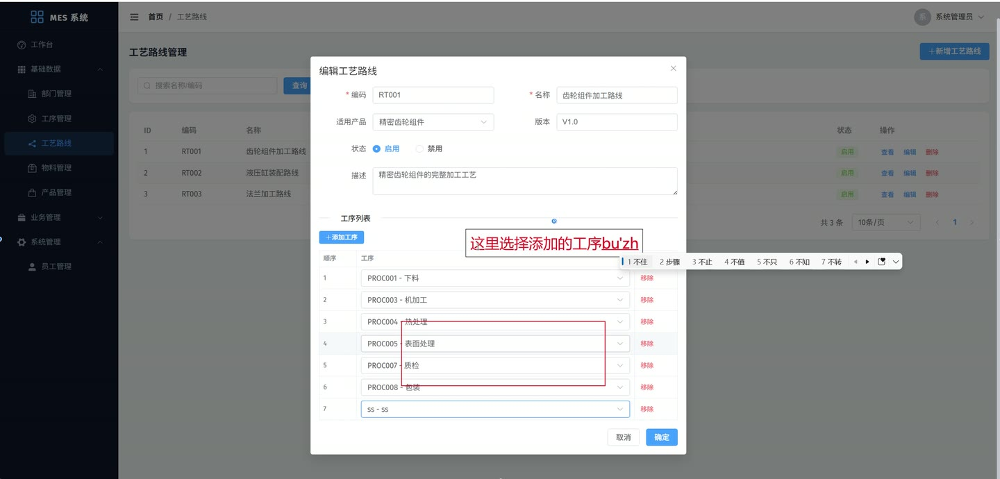
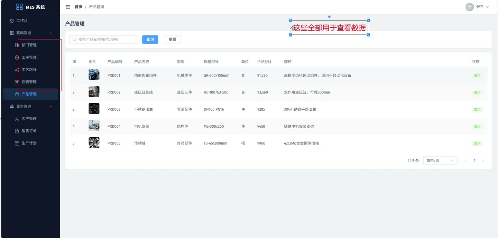
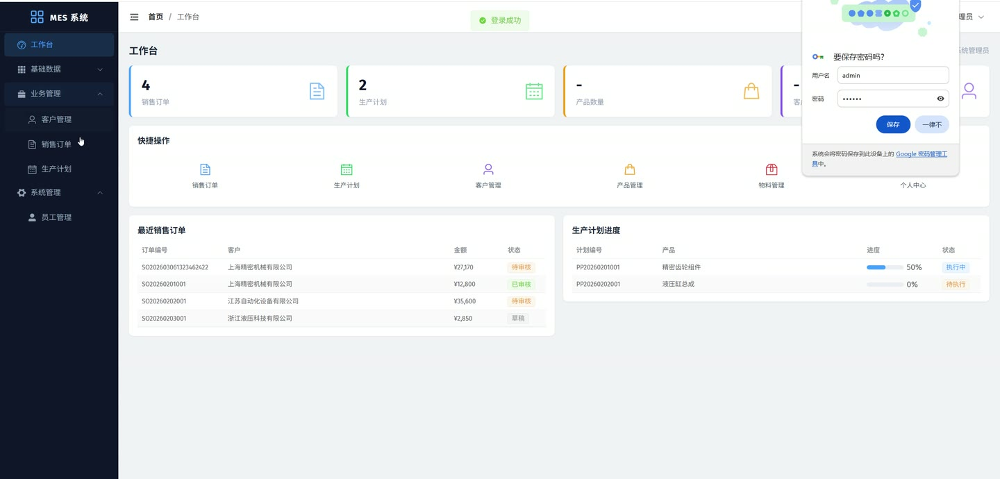
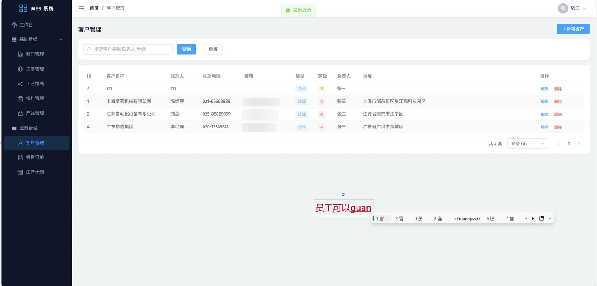
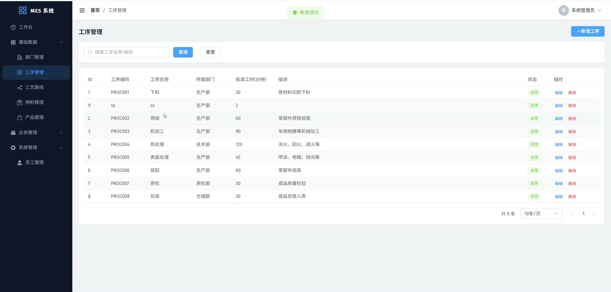

# (附文档)Springboot3+Vue3+MySQL MES生产制造执行系统 K001

### 系统简介

本系统为基于前后端分离架构的MES生产制造执行系统，覆盖销售订单、生产计划、工艺路线、物料与产品等核心制造管理模块。系统内置管理员与普通员工两种角色，通过Spring Security实现权限控制，支持数据隔离（员工只能操作本人相关数据）。
 
### 核心功能
 
### 管理员

 
- 用户管理：分页查询用户列表（支持按部门/角色/关键字筛选），新增/修改/删除用户，重置用户密码为默认密码123456 
- 部门管理：分页查询部门列表（支持按名称/编码关键字搜索），新增/修改/删除部门，获取全部已启用部门用于下拉选择 
- 物料管理：分页查询物料列表（支持按名称/编码/规格关键字搜索，按物料类型筛选），新增/修改/删除物料，查看物料详情（含库存数量、安全库存、单价） 
- 产品管理：分页查询产品列表（支持按名称/编码/规格关键字搜索，按产品类型筛选），新增/修改/删除产品，获取全部已启用产品用于下拉选择 
- 工序管理：分页查询工序列表（支持按名称/编码关键字搜索，自动填充所属部门名称），新增/修改/删除工序，获取全部已启用工序用于下拉选择 
- 工艺路线管理：分页查询工艺路线列表（支持按名称/编码关键字搜索，自动关联产品名称），新增/修改/删除工艺路线，查看工艺路线详情（含关联工序列表及顺序） 
- 销售订单审核：对待审核状态的销售订单进行审核操作，系统自动记录审核人ID与审核时间 
- 查看全部数据：管理员可查看所有员工创建的客户、销售订单、生产计划，不受数据隔离限制 
- 客户管理：分页查询所有客户列表（支持按名称/联系人/电话关键字搜索），新增/修改/删除客户
 
### 普通员工

 
- 客户管理：分页查询本人负责的客户列表（支持按名称/联系人/电话关键字搜索），新增客户时自动设置当前登录用户为负责人，修改/删除本人负责的客户 
- 销售订单管理：分页查询本人创建的订单列表（支持按订单编号关键字搜索、按状态筛选），新增订单时自动设置当前登录用户为创建人，修改/删除本人创建的订单，提交订单审核（将状态改为待审核），作废订单（状态改为已作废） 
- 生产计划管理：分页查询本人负责的生产计划列表（支持按计划编号关键字搜索、按状态筛选），新增计划时自动设置当前登录用户为负责人，修改/删除本人负责的计划，查看计划详情（含产品名称、关联订单编号、工艺路线名称） 
- 个人信息管理：查看当前登录用户信息（含所属部门名称），修改个人信息（姓名、手机、邮箱、头像等），修改登录密码（需验证旧密码） 
- 文件上传：上传文件至服务器，系统按日期自动分目录存储（yyyy/MM/dd格式），返回文件访问URL
 
### 销售订单模块

 
- 新增订单：自动生成订单编号（SO+年月日时分秒+4位随机数），支持录入多条订单明细（选择产品、填写数量与单价），系统自动计算明细小计金额与订单总金额 
- 修改订单：重新录入订单明细时自动重新计算总金额，已审核（状态>=2）的订单不允许修改 
- 提交审核：将订单状态由草稿改为待审核（状态值1） 
- 审核订单（管理员）：将待审核订单改为已审核（状态值2），记录审核人ID与审核时间 
- 作废订单：将订单状态改为已作废（状态值5），生产中或已完成的订单不允许作废 
- 查看详情：展示订单基本信息（客户名称、总金额、交货日期、创建人等）及完整订单明细列表（含产品名称、编号、数量、单价、小计） 
- 下拉选择列表：获取未作废的订单列表（仅含ID与订单编号）
 
### 生产计划模块

 
- 新增计划：自动生成计划编号（PP+年月日时分秒+4位随机数），支持关联销售订单、选择产品与工艺路线，设置计划数量、起止日期、优先级（默认中优先级2） 
- 修改计划：已完成（状态3）或已取消（状态4）的计划不允许修改 
- 查看详情：展示计划基本信息（计划编号、关联订单编号、产品名称、工艺路线名称、负责人姓名、完成数量等） 
- 状态流转：草稿→待执行→执行中→已完成/已取消
 
### 工艺路线模块

 
- 新增工艺路线：填写路线编码/名称/描述/适用产品/版本号，同时添加多条关联工序（指定工序ID与顺序号） 
- 修改工艺路线：自动删除旧工序关联并保存新的工序关联列表 
- 查看详情：展示工艺路线基本信息及关联工序列表（工序名称、编码、顺序），自动填充产品名称
 
### 技术栈

 后端框架Spring Boot 3.x ORMMyBatis-Plus 权限Spring Security + JWT 数据库MySQL 8.x 前端框架Vue 3 状态管理Pinia 构建工具Vite HTTP客户端Axios
 
### 交付内容

 
- 后端完整源码 
- 前端完整源码 
- 数据库初始化脚本 
- 万字文档

## 界面展示

---

## 获取完整源码 + 万字文档

本仓库为项目介绍页。**完整前后端源码、数据库初始化脚本、万字项目文档**，请访问 [codekk.top](http://codekk.top) 获取。

可作课程设计 / 毕业设计参考，支持远程部署调试。